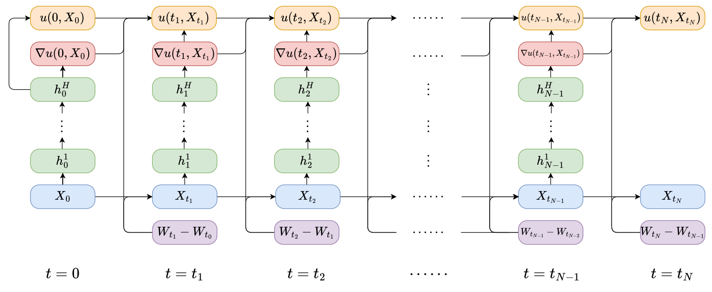

# 求解高维偏微分方程的深度 BSDE 方法简要综述

- 标题: A Brief Review of the Deep BSDE Method for Solving High-Dimensional Partial Differential Equations
- 作者: 韩劼群, Arnulf Jentzen, 鄂维南
- 预印: https://arxiv.org/abs/2505.17032v1
- 时间: 2025-05-07T17:46:56

## 摘要

<!--
High-dimensional partial differential equations (PDEs) pose significant challenges for numerical computation due to the curse of dimensionality, which limits the applicability of traditional mesh-based methods.
Since 2017, the **Deep BSDE method** has introduced deep learning techniques that enable the effective solution of nonlinear PDEs in very high dimensions.
This innovation has sparked considerable interest in using neural networks for high-dimensional PDEs, making it an active area of research.
In this short review, we briefly sketch the **Deep BSDE method**, its subsequent developments, and future directions for the field.
-->

高维偏微分方程 (PDE) 由于维度灾难的存在, 给数值计算带来了重大挑战, 限制了传统基于网格方法的适用性.
自 2017 年以来, **DeepBSDE 方法**引入深度学习技术使得在非常高维度下有效求解非线性 PDE 成为可能.
这一创新激发了使用神经网络求解高维偏微分方程的极大兴趣, 使其成为一个活跃的研究领域.
在这篇简短的综述中, 我们简要概述了 **DeepBSDE 方法**, 其后续发展以及未来发展方向.

## 1·引言

<!--
Partial differential equations (PDEs) are fundamental tools for modeling a wide range of natural and engineering phenomena.
However, developing numerical algorithms to solve high-dimensional PDEs has long been a formidable challenge.
Traditional mesh-based methods, which rely on specific choices of basis, inevitably face the notorious "curse of dimensionality".
Consequently, practical algorithms for tackling high-dimensional problems have been very limited.
The work [^Han2016Deep] was the first to adapt the deep learning framework to solve high-dimensional scientific computing problems, with a focus on stochastic control problems, an area closely linked to Hamilton-Jacobi-Bellman (HJB) PDEs.
Shortly after, the work (**DeepBSDE**[^E2017DeepBSDE] [^Han2018DeepBSDE]) introduced the **Deep BSDE method**, a practical algorithm capable of solving nonlinear PDEs in very high dimensions (hundreds or even thousands) for a broad class of problems.
This method was the first numerical approach based on modern deep learning to effectively address general nonlinear PDEs in high dimensions, opening new possibilities across various disciplines that require solutions to high-dimensional PDEs.
Since its introduction, the use of neural networks to solve PDEs has become one of the most active research areas in applied and computational mathematics.

The following sections provide a brief summary of the **Deep BSDE method**, review the subsequent advances it has inspired, and discuss future prospects for research in high-dimensional PDEs.
-->

偏微分方程是建模许多自然和工程现象的基础工具.
然而, 开发用于求解高维偏微分方程的数值算法长期以来一直是艰巨的挑战.
传统基于网格的方法, 依赖于特定基函数的选择, 必然面临着总所周知的"维度灾难".
因此, 用于处理高维问题的实际算法非常有限.

文献[^Han2016Deep] 首次将深度学习框架用于解决高维科学计算问题, 着重于随机控制问题, 是与 Hamilton-Jacobi-Bellman (HJB) 偏微分方程密切相关的研究领域.
很快, 文献[^E2017DeepBSDE] [^Han2018DeepBSDE] 提出了 **DeepBSDE 方法**, 一种能够有效求解非线性 PDE 在非常高维度 (上百或甚至上千) 问题的实际算法.
该方法是首个基于现代深度学习, 能有效解决高维非线性偏微分方程的数值方法, 为众多需要求解高维偏微分方程的学科领域开辟了新的可能性.
自提出以来, 利用神经网络求解偏微分方程已成为应用数学和计算数学领域最活跃的研究方向之一.

下文将简要概述 **DeepBSDE 方法**, 回顾其激发的后续进展, 并探讨高维偏微分方程研究的未来前景.

## 2·方法总结

We consider the following general semilinear parabolic PDE

$$
\partial_t u + \mu(t, x)\cdot\nabla_x u + \dfrac{1}{2}\text{Tr}\bigl(\sigma(t,x)\sigma(t,x)^\top \text{Hess}_x u\bigr) + f(t, x, u, \sigma(t,x)^{\top}\nabla_x u\big) = 0,
\tag{1}
$$

for $ t \in (0,T) $, $ x \in \mathbb{R}^d $.

Given the terminal condition $u(T,x) = g(x)$, we aim to compute its solution $ u \colon [0,T] \times \mathbb{R}^d \to \mathbb{R} $ at time $t=0$.

Here $\mu \colon [0, T] \times \mathbb{R}^d \to \mathbb{R}^d$ and $\sigma \colon [0, T] \times \mathbb{R}^d \to \mathbb{R}^{d \times d} $ are sufficiently regular functions and for every $ d \times d $-matrix $ A \in \mathbb{R}^{ d \times d } $, we use $A^{\top}$ and $\text{Tr}(A)$ to denote the transpose and the trace of $ A $, respectively.

The **Deep BSDE method** approaches this problem by reformulating the PDE as a variational problem, particularly a stochastic optimal control problem.
This is accomplished through the use of backward stochastic differential euqations (BSDEs) and deep neural networks, which is why it is termed as "Deep BSDE method".
As a by-product, the method also provides an efficient algorithm for solving high-dimensional BSDEs.

---

Recall that the classical Feynman-Kac formula ([^Kac1949Distributions], [^Oksendal2013SDE]) gives a stochastic representation for solutions of linear PDEs of the Kolmogorov type.
BSDE formulations can be interpreted as a nonlinear generalization to the Feynman-Kac formula for a class of nonlinear parabolic PDEs.
Specifically, we consider the forward stochastic differential equation (SDE)

$$
X_t = \xi + \int_0^t\mu(s, X_s)\,\text{d} s +\int_0^t \sigma( s, X_s ) \text{d} W_s
\tag{2}
$$

for $t\in [0,T]$, where $\xi$ is a random variable with support in $ D \subseteq \mathbb{R}^d $ denoting the region in which we are interested in solving the solution $ u(0,\cdot) $ at time $t=0$.

When we evaluate the PDE solution along this process, using Itô's lemma and the PDE in \eqref{eq:PDE}, we obtain that

$$
\begin{aligned}
u(t, X_t) - u(r, X_r)
&= - \int_r^t f\big(s, X_s, u(s, X_s), [\sigma(s, X_s)]^{\top} (\nabla_x u)(s, X_s)\big)\text{d}s \\
& \quad + \int_r^t [\nabla u(s, X_s)]^{\top}\sigma(s, X_s) \text{d}W_s
\end{aligned}
\tag{3}
$$

for $r,t\in [0,T]$ with $r<t$, where we only know the terminal condition $u(T,X_T) = g(X_T)$.

---

The structure of the equations in \eqref{eq:forward_x}-\eqref{eq:backward_u} can be summarized abstractly as BSDEs[^Pardoux1992BSDE]:

$$
\begin{aligned}
X_t & = \xi + \int_0^t\mu(s, X_s) ds +\int_0^t \sigma(s, X_s) \, \text{d}W_s,\\
Y_t & = g(X_T) + \int_t^T f(s, X_s, Y_s, Z_s) \text{d}s - \int_t^T (Z_s)^{\top} \text{d}W_s.
\end{aligned}
\tag{4}
$$

It was shown in [^Pardoux1992BSDE], [^Pardoux1999FBSDE] that there is an appropriate up-to-equivalence unique stochastic process $ ( X_t, Y_t, Z_t ) $, $ t \in [0,T] $, with values in $ \mathbb{R}^d \times \mathbb{R} \times \mathbb{R}^d $ that satisfies the equations in \eqref{eq:BSDE} above.

---

Furthermore, the derivation above illustrates the connection between the BSDE in \eqref{eq:BSDE} and the PDE in \eqref{eq:PDE}.
Let $ u \colon [0,T] \times \mathbb{R}^d \to\mathbb{R} $ be a solution of the PDE in \eqref{eq:PDE} and define

$$
Y_t = u(t, X_t), Z_t = [\sigma(t, X_t)]^{\top}(\nabla_x u)(t, X_t).
\tag{5}
$$

for $ t \in [0,T] $.

Then $ ( X_t, Y_t, Z_t ) $, $ t \in [0,T] $, is a solution for the BSDE in \eqref{eq:BSDE}.

Conversely, by the uniqueness of the BSDE, solving the BSDE in~\eqref{eq:BSDE} also gives the solution to the PDE in~\eqref{eq:PDE}.

---

Given the equivalence between the BSDE and the PDE, we can also reformulate the original PDE problem as the following variational problem:

$$
\begin{align}
&\inf_{Y_0,\{Z_t\}_{0\le t \le T}} \mathbb{E}\big[ |g(X_T) - Y_T|^2 \big], \tag{6}\\
&\text{s.t.}\quad X_t = \xi + \int_{0}^{t}\mu(s,X_s)\, \,\text{d} s + \int_{0}^{t}\sigma(s,X_s)\, \text{d} W_s, \tag{7}\\
&\text{s.t.}\quad Y_t = Y_0 - \int_{0}^{t}f(s,X_s,Y_s,Z_s)\, \text{d} s + \int_{0}^{t}(Z_s)^{\top} \text{d} W_s.\tag{8}
\end{align}
$$

Note that given $Y_0$ and $\{Z_t\}_{0\le t \le T}$, the process of $Y_t$ above is also defined forwardly.
Therefore, one can view this problem as a stochastic control problem, given the process of $X_t$, one chooses starting point $Y_0$ and controls the process $Y_t$ through $Z_t$ such that it matches $g(X_T)$ at the terminal time.
The minimizer of this variational problem is the solution to the PDE and vice versa.

---

The remaining task is to solve the above variational problem numerically.
A key idea of the **Deep BSDE method** is to approximate the unknown functions $X_0 \mapsto u(0, X_0)$ for $Y_0$ and $X_t \mapsto [ \sigma(t,X_t) ]^{ \top } ( \nabla_x u )(t,X_t)$ for $Z_t$ (see \eqref{eq:nonlinear_Feynman_Kac}) by feedforward neural networks $\psi$ and $\phi$.
Then, we discretize time, say, by using the Euler scheme on a grid $0 = t_0 < t_1 < \ldots < t_N = T$:

$$
\begin{align}
&\inf_{\psi_0, \{\phi_n\}_{n=0}^{N-1}} \mathbb{E} |g(X_T) - Y_T|^2, \tag{9}\\
&\text{s.t.}\quad X_0 = \xi, \quad Y_0 = \psi_0(\xi), \tag{10}\\
&\text{s.t.}\quad X_{t_{n+1}} = X_{t_n} + \mu(t_n,X_{t_n})\Delta t_n + \sigma(t_n,X_{t_n})\Delta W_n, \tag{11}\\
&\text{s.t.}\quad Z_{t_n} = \phi_n(X_{t_n}), \tag{12}\\
&\text{s.t.}\quad Y_{t_{n+1}} = Y_{t_n} - f(t_n,X_{t_n},Y_{t_n},Z_{t_n})\Delta t_n + (Z_{t_n})^{\top}\Delta W_n.\tag{13}
\end{align}
$$

At each time step $t_n$, we associate a subnetwork.
By stacking these subnetworks together, we form a deep neural network.
This network takes the paths $\{ X_{ t_n } \}_{ 0 \leq n \leq N }$ and $\{ W_{ t_n } \}_{ 0 \leq n \leq N }$ as the input data and produces the final output, denoted by $\hat{u}(\{ { X_{ t_n } } \}_{ 0 \leq n \leq N }, \{ W_{ t_n } \}_{ 0 \leq n \leq N } )$, as an approximation to $u( t_N, X_{ t_N } )$.

The network architecture is illustrated in Figure~\ref{fig}, which is reprinted from the original work [^E2017DeepBSDE].
The resulting network has a very natural **residual neural network** structure[^He2016ResNet] embedded in the stochastic difference equations in \eqref{eq:discretized_Y}.

---

Figure 1: Network architecture for solving parabolic PDEs.
Each column corresponds to a subnetwork at time $ t = t_n $.
Reprinted from [^E2017DeepBSDE].

---

The error in matching the given terminal condition defines the loss function:

$$
l(\theta) = \mathbb{E}\Big[\big|g(X_{t_N})-\hat{u}\big(\{X_{t_n}\}_{0\leq n \leq N}, \{W_{t_n}\}_{0 \leq n \leq N}\big)\big|^2\Big].
\tag{14}
$$

From a machine learning perspective, this loss function does not require the generation of training data in advance.
The initial condition $X_{t_0}$ and the paths $\{ W_{ t_n } \}_{ 0 \leq n \leq N }$ serve as the data, and they are generated on the fly very easily.
As a result, this model can be thought of as having access to an infinite amount of data, making it particularly suitable for training with stochastic gradient descent (SGD).
Note that we denote the different networks by $\psi_0$ and $\{\phi_n\}_{n=0}^{N-1}$.
These networks can have independent or shared parameters, which does not impact the application of SGD.
Additionally, suppose we are only interested in the PDE solution at a single spatial point $x_0$.
In that case, we can set $\xi = \xi_0$ as a deterministic value, simplifying $\phi_0 = u(0, \xi_0)$ and $\psi_0 = \nabla_x u(0, \xi_0)$ to deterministic values that can also be optimized.

---

By leveraging stochastic reformulation and deep neural network approximation, the **Deep BSDE method** proposed above can solve several high-dimensional PDEs in the region of interest efficiently.
We refer to **DeepBSDE**[^E2017DeepBSDE], [^Han2018DeepBSDE] for various numerical examples.

## 3·后续进展

The success of the **Deep BSDE method** has sparked a wide range of research efforts aimed at leveraging deep learning to tackle high-dimensional PDEs, leading to significant advancements in various scientific and engineering fields.
In this section, we briefly review selected subsequent works that focus on solving high-dimensional PDEs, particularly those pose intrinsic challenges for classical methods, and we also briefly mention selected research efforts regarding the theoretical analysis of such deep learning-based approximation methods for high-dimensional PDEs.
For more comprehensive discussions and further references, we refer, for example, to the review papers ([^E2021Algorithms], [^Germain2021Neural], [^Beck2023Survey], [^Blechschmidt2021Survey]).

---

**Methods based on BSDEs and related stochastic Feyman-Kac formulations.**

The efficiency and applicability of BSDE-based methods have been enhanced in various ways; see, for example, [^Beck2019Machine], [^Fujii2019Asymptotic], [^Nusken2021Solving], [^Hure2020Deep], [^Ji2020Three], [^Pham2021Neural], [^Nusken2023Interpolating], [^Han2024DeepPicard].
In particular, the stochastic optimization objective in~\eqref{eq:BSDE_objective} derived from BSDEs is well-suited to the prevailing deep learning optimization paradigm based on SGD.
This framework can be naturally extended to various contexts, including the actor-critic algorithm for the HJB equation[^Zhou2021Actor], [^Ata2023Drift], Nash equilibrium in multi-agent or mean-field games[^Han2019Deep], [^Han2024Learning], [^Lauriere2022Learning], elliptic problems[^Han2020Solving], [^Han2020Derivative], [^Nusken2023Interpolating], as well as seconds order BSDEs and fully-nonlinear PDEs[^Beck2019Machine], [^Han2024DeepPicard].
We also refer, for example, to [^Beck2021Deep], [^Beck2021Solving], [^Berner2020Numerically] for deep learning approximation methods for (parametric) linear and semilinear Kolmogorov PDEs based on classical linear Feynman-Kac formulations using standard forward SDEs.

---

**Methods based on the least-squares formulation.**

Besides stochastic reformulations based on BSDEs and SDEs, there are other widely used formulations for designing numerical algorithms for PDEs, among which the least-squares formulation is one of the most versatile.
This approach transforms a PDE problem into a variational problem by minimizing the squared residual of the PDE.
In classical numerical analysis, this method is often less preferred because the resulting numerical problems tend to be more poorly conditioned compared to those from other formulations.
By replacing the space of trial functions with the hypothesis space of neural networks, this formulation has led to the development of **Physics-Informed Neural Networks (PINNs)** (**DGM**[^Sirignano2018DGM], **PINN**[^Raissi2019PINN]) (although the method in **DGM**[^Sirignano2018DGM] is typically referred to as **Deep Galerkin method**).
Notably, such deep learning methods for PDEs based on the least-squares formulation were proposed and studied as early as the 1990s in the context of low-dimensional PDEs (see, for example, [^Lagaris1998Artificial], [^Dissanayake1994Neural], [^Jianyu2003Numerical]).
Originally developed for solving low-dimensional PDEs, PINNs have quickly gained popularity due to their generality and ease of implementation.
Recently, they have also been adapted to address high-dimensional PDEs when combined with Hutchinson trace estimation[^Hu2024Hutchinson].
For further references in this line of research we also refer, for example, to the survey articles [^Cuomo2022Survey], [^Karniadakis2021PIML].

---

**Methods based on the Ritz formulation**

The Ritz formulation is a classical variational approach for solving PDEs.
By using neural networks as trial functions, this approach naturally leads to the development of the Deep Ritz method in [^E2018DRM].
A closely related area is variational Monte Carlo, which is used to solve for the eigenfunctions of the Schrödinger equation.
There has been growing interest in constructing neural network-based wavefunctions for this problem, starting with the influential work[^Carleo2017Solving] on spin systems, and later extending to many-electron systems[^Han2019Solving], [^Luo2019Backflow], [^Pfau2019Ab-Initio], [^Hermann2019Deep].

---

**Methods based on the Galerkin formulation.**

The Galerkin formulation is another popular approach for solving PDEs in engineering and mathematical modeling, based on the weak formulation of a PDE that involves both trial and test functions.
Designing machine learning-based algorithms using the Galerkin formulation is much less straightforward than the previous formulations, as it is not a standard optimization-based approach.
The work[^Zang2020WAN] innovatively interprets the weak solution as the solution of a min-max problem and then develops an algorithm to train neural network-based approximations to PDEs in an adversarial way (for example, also [^Chen2023Friedrichs], [^Valsecchi2022XNODE-WAN]).

---

**Mathematical analysis of deep learning-based approximation methods for PDEs.**

The rapid numerical progress in this field has opened new avenues for theoretical investigations for deep neural network-based approximations for high-dimensional PDEs.
While some advances have been made (see, for example, [^Han2018Convergence], [^Hutzenthaler2020Proof], [^Knochenhauer2022Convergence], [^Lu2021Priori], [^Chen2021Representation], [^Han2022Convergence], [^Duan2022Convergence], [^Grohs2023Proof], [^Carmona2021Convergence], [^Carmona2022Convergence], [^Berner2020Analysis]), a full understanding of the overall error in deep learning methods—including approximation, generalization, and optimization errors—remains incomplete, even in the relatively simpler case of one-dimensional settings.
The approximation error that arises when deep neural networks are used to approximate solutions of PDEs, along with the generalization error to some extent, appears to be comparatively better understood from a theoretical perspective.
Particularly, several results in the literature rigorously prove that deep neural networks can approximate solutions of high-dimensional PDEs without the curse of dimensionality (for example, [^Berner2020Analysis], [^Beznea2022Monte], [^Cheridito2023Efficient], [^Elbraechter2018DNN], [^Grohs2022Deep], [^Grohs2023Proof], [^Jentzen2021Proof] and the references therein for such approximation results for linear PDEs and cf., for instance, [^Ackermannetal2024Deep], [^Cioica2022Deep], [^Hutzenthaler2020Proof], [^Neufeld2024Rectified], [^Neufeld2023Deep] and the references therein for such approximation results for semilinear PDEs with Lipschitz nonlinearities).
Specifically, such results reveal that the number of real parameters of the approximating deep neural networks grows only at most polynomially in both the reciprocal $ \dfrac{1}{\varepsilon} $ of the prescribed approximation accuracy $ \varepsilon > 0 $ and the PDE dimension $ d \in \N $.

## 4·未来展望

As the field of machine learning-based methods for solving high-dimensional PDEs continues to evolve, several areas with significant applications stand out as promising directions for future research.
While existing works have made considerable progress, there remain challenges that require further development to fully realize the potential of these approaches.
Below, we highlight a few key areas.

**Optimal Control and HJB Equation**

Optimal control problems often involve solving high-dimensional HJB equations, where the curse of dimensionality was originally coined and is closely related to the BSDE formulation discussed earlier.
Recent works[^Nakamura2021Adaptive], [^Zhang2022Initial] have shown promising results using deep learning techniques for optimal feedback control.
However, the complexity of real-world problems still demands further advancements.
In financial mathematics and economics, optimal decision-making in high-dimensional and stochastic environments is a common challenge, and extensive research has been conducted in these directions[^Becker2020Pricing], [^Liang2021Deep], [^Beck2021Deep], [^Gnoatto2023Deep], [^Payne2024Deep], [^Domingo2024Stochastic].

---

**Probabilistic Modeling and High-Dimensional Densities**

Probabilistic modeling involving high-dimensional densities also faces the curse of dimensionality.
In recent years, learning methods based on PDEs, such as the Fokker-Planck equation, and SDEs have achieved significant advances in solving and sampling high-dimensional densities[^Boffi2024Deep], [^Song2021Score], [^Han2024DeepPicard], in a similar spirit to the **Deep BSDE method** introduced earlier.
However, many challenges remain in improving the accuracy and efficiency of these methods, making this a rich area for future research.

---

**Quantum Mechanics and the Schrödinger Equation**

The Schrödinger equation is fundamental to quantum mechanics, yet finding accurate solutions in high dimensions remains a significant challenge.
While neural network-based approaches, as mentioned earlier, have shown potential in approximating wavefunctions with high precision, issues such as scalability and the need for more efficient training algorithms are still unresolved.
Additionally, the time-dependent Schrödinger equation has been much less explored compared to its time-independent counterpart, presenting another avenue for future research.

---

**Plasma Physics and Kinetic Equations**

Kinetic equations, such as the Boltzmann equation, are crucial for modeling the behavior of gases and plasmas.
Although the dimensionality of these equations is not exceedingly high, the complexity of particle physics results in intimidating computational costs.
Since the work[^Han2019Uniformly], deep learning-based closures for kinetic equations have emerged as a promising approach to reduce simulation costs[^Huang2022Machine], [^Li2023Learning].
Future work could include improving the scalability of these methods to larger-scale problems and enhancing the interpretability of the resulting models.

---

**Theoretical Advancements**

Despite the progress that has been made in the theoretical analysis of deep learning methods for high-dimensional PDEs, developing a complete convergence analysis remains a fundamental open problem for essentially all deep learning-based approximation methods for PDEs ([^Gonon2023Random]).
While several open questions remain regarding approximation and generalization errors—particularly for high-dimensional PDEs with gradient-dependent nonlinearities, such as HJB equations ([^Hutzenthaler2019Overcoming], [^Neufeld2024Rectified])—the optimization error of deep learning methods poses an especially significant challenge.
This difficulty persists even in the case of one-dimensional PDEs and one-dimensional target functions (for instance, [^Gentile2022Approximation], [^Ibragimov2022Convergence], [^Welper2023Approximation]).

## 参考文献

[^Han2016Deep]: Deep Learning Approximation for Stochastic Control Problems.
[^E2017DeepBSDE]: Deep Learning-Based Numerical Methods for High-Dimensional Parabolic Partial Differential Equations and Backward Stochastic Differential Equations.
[^Han2018DeepBSDE]:  Solving High-Dimensional Partial Differential Equations Using Deep Learning.
[^Kac1949Distributions]: On Distributions of Certain Wiener Functionals.
[^Oksendal2013SDE]: Stochastic Differential Equations: An Introduction with Applications.
[^Pardoux1992BSDE]: Backward Stochastic Differential Equations and Quasilinear Parabolic Partial Differential Equations.
[^Pardoux1999FBSDE]: Forward-Backward Stochastic Differential Equations and Quasilinear Parabolic PDEs.
[^He2016ResNet]: Deep Residual Learning for Image Recognition.
[^E2021Algorithms]: Algorithms for Solving High Dimensional PDEs: From Nonlinear Monte Carlo to Machine Learning.
[^Germain2021Neural]: Neural Networks-Based Algorithms for Stochastic Control and PDEs in Finance.
[^Beck2023Survey]: An Overview on Deep Learning-Based Approximation Methods for Partial Differential Equations.
[^Blechschmidt2021Survey]: Three Ways to Solve Partial Differential Equations with Neural Network — A Review.
[^Beck2019Machine]: Machine Learning Approximation Algorithms for High-Dimensional Fully Nonlinear Partial Differential Equations and Second-Order Backward Stochastic Differential Equations.
[^Fujii2019Asymptotic]: Asymptotic Expansion as Prior Knowledge in Deep Learning Method for High Dimensional BSDEs.
[^Nusken2021Solving]: Solving High-Dimensional Hamilton–Jacobi–Bellman PDEs Using Neural Networks: Perspectives from the Theory of Controlled Diffusions and Measures on Path Space.
[^Hure2020Deep]: Deep Backward Schemes For High-Dimensional Nonlinear PDEs.
[^Ji2020Three]: Three Algorithms for Solving High-Dimensional Fully-Coupled FBSDEs through Deep Learning.
[^Pham2021Neural]: Neural Networks-Based Backward Scheme for Fully Nonlinear PDEs.
[^Nusken2023Interpolating]: Interpolating between BSDEs and PINNs: Deep Learning for Elliptic and Parabolic Boundary Value Problems.
[^Han2024DeepPicard]: Deep Picard Iteration for High-Dimensional Nonlinear PDEs.
[^Zhou2021Actor]: Actor-Critic Method for High Dimensional Static Hamilton–Jacobi–Bellman Partial Differential Equations Based on Neural Networks.
[^Ata2023Drift]: Drift Control of High-Dimensional RBM: A Computational Method Based on Neural Networks.
[^Han2019Deep]: Deep Fictitious Play for Finding Markovian Nash Equilibrium in Multi-Agent Games.
[^Han2024Learning]: [Learning High-Dimensional McKean–Vlasov Forward-Backward Stochastic Differential Equations with General Distribution Dependence.](2022.04.25_Learning_High-Dimensional_MV-FBSDEs_with_General_Distribution_Dependence.md)
[^Lauriere2022Learning]: Learning Mean Field Games: A Survey.
[^Han2020Solving]: Solving High-Dimensional Eigenvalue Problems Using Deep Neural Networks: A Diffusion Monte Carlo Like Approach.
[^Han2020Derivative]: A Derivative-Free Method for Solving Elliptic Partial Differential Equations with Deep Neural Networks.
[^Beck2021Deep]: Deep Splitting Method for Parabolic PDEs.
[^Beck2021Solving]: Solving the Kolmogorov PDE by Means of Deep Learning.
[^Berner2020Numerically]: Numerically Solving Parametric Families of High-Dimensional Kolmogorov Partial Differential Equations via Deep Learning.
[^Sirignano2018DGM]: DGM: A Deep Learning Algorithm for Solving Partial Differential Equations.
[^Raissi2019PINN]: Physics-Informed Neural Networks: A Deep Learning Framework for Solving Forward and Inverse Problems Involving Nonlinear Partial Differential Equations.
[^Lagaris1998Artificial]: Artificial Neural Networks for Solving Ordinary and Partial Differential Equations.
[^Dissanayake1994Neural]: Neural-Network-Based Approximations for Solving Partial Differential Equations.
[^Jianyu2003Numerical]: Numerical Solution of Elliptic Partial Differential Equation Using Radial Basis Function Neural Networks.
[^Hu2024Hutchinson]: Hutchinson Trace Estimation for High-Dimensional and High-Order Physics-Informed Neural Networks.
[^Cuomo2022Survey]: Scientific Machine Learning through Physics-Informed Neural Networks: Where We Are and What’S Next.
[^Karniadakis2021PIML]: Physics-Informed Machine Learning.
[^E2018DRM]: The Deep Ritz Method: A Deep Learning-Based Numerical Algorithm for Solving Variational Problems.
[^Carleo2017Solving]: Solving the Quantum Many-Body Problem with Artificial Neural Networks.
[^Han2019Solving]: Solving Many-Electron Schrödinger Equation Using Deep Neural Networks.
[^Luo2019Backflow]: Backflow Transformations via Neural Networks for Quantum Many-Body Wave Functions.
[^Pfau2019Ab-Initio]: Ab-Initio Solution of the Many-Electron Schrödinger Equation with Deep Neural Networks.
[^Hermann2019Deep]: Deep Neural Network Solution of the Electronic Schrödinger Equation.
[^Zang2020WAN]: Weak Adversarial Networks for High-Dimensional Partial Differential Equations.
[^Chen2023Friedrichs]: Friedrichs Learning: Weak Solutions of Partial Differential Equations via Deep Learning.
[^Valsecchi2022XNODE-WAN]: Towards Fast Weak Adversarial Training to Solve High Dimensional Parabolic Partial Differential Equations Using XNODE-WAN.
[^Han2018Convergence]: Convergence of the Deep BSDE Method for Coupled FBSDEs.
[^Hutzenthaler2020Proof]: A Proof that Rectified Deep Neural Networks Overcome the Curse of Dimensionality in the Numerical Approximation of Semilinear Heat Equations.
[^Knochenhauer2022Convergence]: Convergence Rates for a Deep Learning Algorithm for Semilinear PDEs.
[^Lu2021Priori]: A Priori Generalization Analysis of the Deep Ritz Method for Solving High Dimensional Elliptic Partial Differential Equations.
[^Chen2021Representation]: On the Representation of Solutions to Elliptic PDEs in Barron Spaces.
[^Han2022Convergence]: Convergence of Deep Fictitious Play for Stochastic Differential Games.
[^Duan2022Convergence]: Convergence Rate Analysis for Deep Ritz Method.
[^Grohs2023Proof]: A Proof that Artificial Neural Networks Overcome the Curse of Dimensionality in the Numerical Approximation of Black–Scholes Partial Differential Equations.
[^Carmona2021Convergence]: Convergence Analysis of Machine Learning Algorithms for the Numerical Solution of Mean Field Control and Games I: The Ergodic Case.
[^Carmona2022Convergence]: Convergence Analysis of Machine Learning Algorithms for the Numerical Solution of Mean Field Control and Games II: The Finite Horizon Case.
[^Berner2020Analysis]: Analysis of the Generalization Error: Empirical Risk Minimization over Deep Artificial Neural Networks Overcomes the Curse of Dimensionality in the Numerical Approximation of Black-Scholes Partial Differential Equations.
[^Beznea2022Monte]: From Monte Carlo to Neural Networks Approximations of Boundary Value Problems.
[^Cheridito2023Efficient]: Efficient Sobolev Approximation of Linear Parabolic PDEs in High Dimensions.
[^Elbraechter2018DNN]: DNN Expression Rate Analysis of High-Dimensional PDEs: Application to Option Pricing.
[^Grohs2022Deep]: Deep Neural Network Approximation for High-Dimensional Elliptic PDEs with Boundary Conditions.
[^Jentzen2021Proof]: A Proof that Deep Artificial Neural Networks Overcome the Curse of Dimensionality in the Numerical Approximation of Kolmogorov Partial Differential Equations with Constant Diffusion and Nonlinear Drift Coefficients.
[^Ackermannetal2024Deep]: Deep Neural Networks with ReLU, Leaky ReLU, and Softplus Activation Provably Overcome the Curse of Dimensionality for Space-Time Solutions of Semilinear Partial Differential Equations.
[^Cioica2022Deep]: Deep Neural Networks Overcome the Curse of Dimensionality in the Numerical Approximation of Semilinear Partial Differential Equations.
[^Neufeld2024Rectified]: Rectified Deep Neural Networks Overcome the Curse of Dimensionality in the Numerical Approximation of Gradientdependent Semilinear Heat Equations.
[^Neufeld2023Deep]: Deep ReLU Neural Networks Overcome the Curse of Dimensionality When Approximating Semilinear Partial Integro-Differential Equations.
[^Nakamura2021Adaptive]: Adaptive Deep Learning for High-Dimensional Hamilton–Jacobi–Bellman Equations.
[^Zhang2022Initial]: Initial Value Problem Enhanced Sampling for Closed-Loop Optimal Control Design with Deep Neural Networks.
[^Becker2020Pricing]: Pricing and Hedging American-Style Options with Deep Learning.
[^Liang2021Deep]: Deep Learning-Based Least Squares Forwardbackward Stochastic Differential Equation Solver for High-Dimensional Derivative Pricing.
[^Gnoatto2023Deep]: Deep xVA Solver: A Neural Network–Based Counterparty Credit Risk Management Framework.
[^Payne2024Deep]: Deep Learning for Search and Matching Models.
[^Domingo2024Stochastic]: Stochastic Optimal Control Matching.
[^Boffi2024Deep]: Deep Learning Probability Flows and Entropy Production Rates in Active Matter.
[^Song2021Score]: Score-Based Generative Modeling through Stochastic Differential Equations.
[^Han2019Uniformly]: Uniformly Accurate Machine Learning-Based Hydrodynamic Models for Kinetic Equations.
[^Huang2022Machine]: Machine Learning Moment Closure Models for the Radiative Transfer Equation I: Directly Learning a Gradient Based Closure.
[^Li2023Learning]: Learning Invariance Preserving Moment Closure Model for Boltzmann–BGK Equation.
[^Gonon2023Random]: Random Feature Neural Networks Learn Black-Scholes Type PDEs without Curse of Dimensionality.
[^Hutzenthaler2019Overcoming]: Overcoming the Curse of Dimensionality in the Numerical Approximation of Parabolic Partial Differential Equations with Gradient-Dependent Nonlinearities.
[^Gentile2022Approximation]: Approximation Results for Gradient Descent Trained Shallow Neural Networks in 1D.
[^Ibragimov2022Convergence]: Convergence to Good Nonoptimal Critical Points in the Training of Neural Networks: Gradient Descent Optimization with One Random Initialization Overcomes All Bad Non-Global Local Minima with High Probability
[^Welper2023Approximation]: Approximation Results for Gradient Descent Trained Neural Networks.